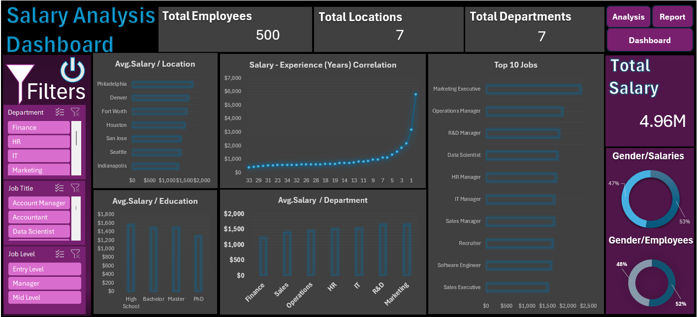

# 📊 HR Salary & Performance Analysis Dashboard

A comprehensive, professional-grade Excel dashboard built to analyze HR data, employee compensation, department distribution, and workforce metrics. This project demonstrates advanced data analysis and visualization techniques using Microsoft Excel.

## 🚀 Project Overview
This project simulates real-world HR data analytics to provide human resources management with actionable insights regarding employee salaries, departmental performance, experience impact, and educational background distribution.

## 🛠️ Tools & Technologies Used
* **Microsoft Excel**: Data Cleaning, Power Query concepts, XLOOKUP, SUMIFS, Pivot Tables, and Pivot Charts.
* **Data Visualization**: Interactive Slicers, custom dark-mode UI design, and dynamic KPI cards.
* **Business Intelligence**: Translating raw employee records into strategic insights.

## 📈 Key Performance Indicators (KPIs) & Metrics Tracked
* **Total Employees & Headcount** across departments.
* **Average Salaries** by Job Title, Department, and Education Level.
* **Salary vs. Experience** trends and correlations.
* **Demographic Distributions** by Gender, Age, and Location.

## 🎛️ Interactive Dashboard Features
* **Department & Job Title Slicers**: Seamlessly filter the entire dashboard by specific business units.
* **Dynamic Visuals**: Pivot charts updating instantly based on user selections.
* **Professional UI/UX**: Clean dark-themed executive design structured for clear visibility and rapid decision-making.

## 📂 Dataset Structure
* **Employee_Salaries**: Raw dataset containing employee IDs, names, departments, job titles, gender, age, experience years, salary, location, and education levels.
* **Analysis & Pivot Table Sheets**: Aggregated data models powering the visualizations.
* **Dashboard Sheet**: The main interactive executive control panel.

## 📷 Dashboard Preview

---
Developed by **Mohamed Elzewaidi** | [LinkedIn Profile](https://www.linkedin.com) | [GitHub Profile](https://github.com)
